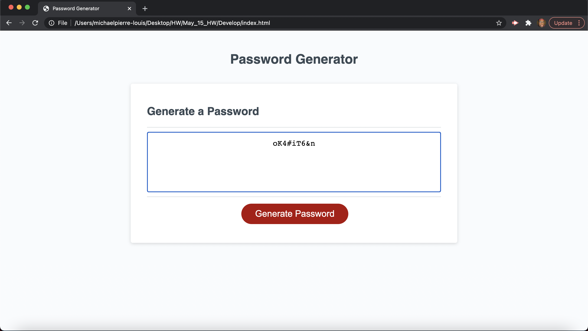

# Random Password Generator - 5/15/21

# My Task:

Generate a secure password using selected character types from four categories : uppercase letters, lowercase letter, special characters and numbers chosen through props. 

Here is the acceptance criteria:

## Acceptance Criteria

```
GIVEN I need a new, secure password
WHEN I click the button to generate a password
THEN I am presented with a series of prompts for password criteria
WHEN prompted for password criteria
THEN I select which criteria to include in the password
WHEN prompted for the length of the password
THEN I choose a length of at least 8 characters and no more than 128 characters
WHEN prompted for character types to include in the password
THEN I choose lowercase, uppercase, numeric, and/or special characters
WHEN I answer each prompt
THEN my input should be validated and at least one character type should be selected
WHEN all prompts are answered
THEN a password is generated that matches the selected criteria
WHEN the password is generated
THEN the password is either displayed in an alert or written to the page
```

Here is a screenshot of my deployed application: 



[Here](https://mgpierrelouis.github.io/Random_Password_Generator/) is a link to the deployed applicaiton, and [here](https://github.com/mgpierrelouis/Randomg_Password_Generator) is a link to the github repository.


